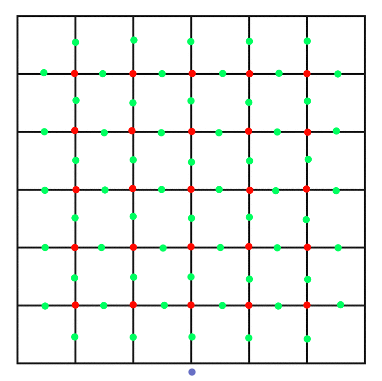

# Voxel renderer: Evens-odds chunks

This branch is my first attempt at generating a chunk mesh that allows for fixed-proportion voxel smoothing, where voxels don't change sizes when connected to other voxels.

The algorithm used, found in `voxel-renderer::world::Chunk::build_vertex_grid()` (at `src/world/chunk.rs:187`), is composed of three main parts:

1. The lines, which alternate between even and odd Y coordinates. The evens line is `Chunk::Width` vertices long, while the odds line is `Chunk::Width + 1` vertices long and is at an offset of -0.5 units.
2. The stacks, which are vertical sequences of lines that also alternate between evens and odds, only on the Z coordinates. The evens stack is `Chunk::Height` lines tall while the odds stack is `Chunk::Height * 2 + 1` lines tall.
    - The vertices in an evens stack are placed either before or after voxels, while the ones in odds stacks are placed either above, below, to the left or to the right of voxels.
3. The stack array (which I just named `depth` in code), which is a sequence of stacks that grows towards +Z (or South) and is `Chunk::Depth * 2 + 1` stacks long.

This algorithm generates a grid of vertices that will make it so that for any given voxel inside a chunk, there will always be one vertex on each cardinal direction (Top, Bottom, North, South, East and West), at a distance of 0.5 units.

> This is a representation of a vertical slice of an odds stack generated with this algorithm.

I decided to save this algorithm because while it may not be the solution to my journey on rendering smooth voxels, it still is really interesting and might be useful for something else.